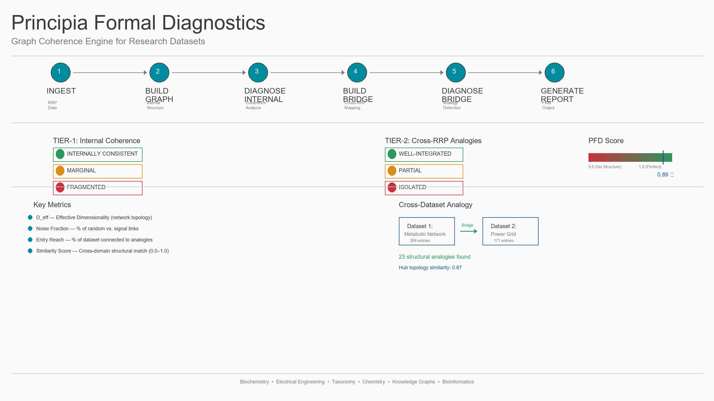

# Principia Formal Diagnostics (PFD)
## Graph Coherence Engine for Research Datasets

**Automatically analyze research datasets for structural coherence, dimensionality, and cross-domain analogies.**

Upload your data (metabolic networks, taxonomies, power grids, chemical databases, knowledge graphs), and PFD checks:
- ✅ **Is this internally consistent?** (Tier-1: Internal Coherence)
- ✅ **How does it relate to other datasets?** (Tier-2: Cross-Dataset Analogies)
- ✅ **What's the final quality score?** (PFD Score: 0.0–1.0)

**No hosting. No LLM backend. No cost beyond your existing Claude subscription.**

---

## Workflow Overview

[](PFD_WORKFLOW_DIAGRAM.png)

**[→ Read the full USER_GUIDE for detailed walkthroughs](USER_GUIDE.md)**

---

## Quick Start (5 Minutes)

### 1. Install
```bash
git clone https://github.com/IanD25/ds-wiki-transformer.git
cd ds-wiki-transformer
bash setup.sh
```

### 2. Prepare Your Data
Create two CSV files: `entries.csv` and `links.csv`

**entries.csv:**
```csv
entry_id,title,description,entry_type,domain
E001,Pyruvate,Central metabolite,instantiation,biochemistry
E002,Acetyl-CoA,Activated group carrier,instantiation,biochemistry
```

**links.csv:**
```csv
source_id,target_id,link_type,description
E001,E002,produces,Pyruvate → Acetyl-CoA in TCA cycle
```

### 3. Run Analysis
```bash
# Ingest your data
python3 scripts/ingest_your_dataset.py \
    --entries entries.csv \
    --links links.csv \
    --name my_dataset \
    --output data/rrp/my_dataset/

# Run internal diagnostics (Tier-1)
python scripts/run_fisher_suite.py --mode internal_rrp \
    --rrp-db data/rrp/my_dataset/rrp_my_dataset.db

# Optional: Compare to another dataset (Tier-2)
python scripts/run_fisher_suite.py --mode report \
    --rrp-db data/rrp/my_dataset/rrp_my_dataset.db \
    --rrp-compare data/rrp/another_dataset/rrp_another_dataset.db
```

### 4. View Results
- `rrp_my_dataset_report.json` — Full diagnostics
- `rrp_my_dataset_visualization.html` — Interactive graph
- `rrp_my_dataset_summary.txt` — Human-readable verdict

**For detailed workflows and examples, see [USER_GUIDE.md](USER_GUIDE.md).**

---

## Architecture

PFD operates in a **6-step diagnostic pipeline**:

```
Your Research Dataset (RRP)
    ↓
[Step 1] INGEST       → Parse entries + links into RRP schema
[Step 2] BUILD GRAPH  → Model dataset structure
[Step 3] DIAGNOSE     → Compute Tier-1 (internal coherence)
    ↓
[Tier-1 Output]       → Coherence verdict + metrics
    ↓
[Step 4] BUILD BRIDGE → (Optional) Compare to other RRPs
[Step 5] BRIDGE TEST  → Compute Tier-2 (cross-RRP analogies)
    ↓
[Tier-2 Output]       → Analogy verdict + bridge list
    ↓
[Step 6] REPORT       → Final PFD Score (0.0–1.0)
```

**Key Components:**
- **Fisher Suite** (`src/analysis/fisher_diagnostics.py`): Topology-based coherence metrics (D_eff, noise fraction, regime classification)
- **Pass 2** (`src/ingestion/cross_universe_query.py`): Cross-RRP similarity detection using semantic embeddings
- **RRP Schema** (`data/rrp/*/`): Standardized SQLite format for any research dataset
- **Reports** (`src/analysis/fisher_report.py`): Two-tier verdict generation + JSON/HTML output

---

## Supported Datasets

PFD works on any structured dataset with entries (nodes) and links (edges):

- **Biochemistry**: Metabolic networks, gene regulatory networks, protein interaction networks
- **Electrical Engineering**: Power grids, circuit topologies, network infrastructures
- **Taxonomy**: Species classification, biological hierarchies, knowledge graphs
- **Chemistry**: Periodic table properties, reaction networks, molecular interactions
- **Computer Science**: Complexity hierarchies, algorithm dependencies, knowledge structures
- **General**: Any domain with entities and relationships

**Included Examples:**
- E. coli core metabolic network (304 entries, 536 links)
- Zoo animal taxonomy (426 entries, 437 links)
- Periodic Table (119 elements, 1,671 properties)
- IEEE Power Grids (case14, case57, case118; 14–118 buses)

---

## Documentation

| Document | Purpose |
|----------|---------|
| **[USER_GUIDE.md](USER_GUIDE.md)** | **Start here** — Step-by-step workflows, report interpretation, examples |
| [MASTER_SUMMARY.md](MASTER_SUMMARY.md) | Full technical deep-dive for engineers and contributors |
| [FISHER_PIPELINE_REDESIGN.md](FISHER_PIPELINE_REDESIGN.md) | Specification for the 6-step PFD pipeline |
| [CLAUDE.md](CLAUDE.md) | Project context for LLM assistants (auto-loaded) |
| [docs/design_philosophy/STRUCTURAL_REVELATION.md](docs/design_philosophy/STRUCTURAL_REVELATION.md) | Design manifesto for visual materials |

---

## Running PFD

```bash
# Test (407 tests)
python -m pytest tests/ -v

# Run Fisher Suite diagnostics
python scripts/run_fisher_suite.py --mode internal_rrp \
    --rrp-db data/rrp/ecoli_core/rrp_ecoli_core.db

# Full analysis with bridge comparison
python scripts/run_fisher_suite.py --mode report \
    --rrp-db data/rrp/dataset1/rrp_dataset1.db \
    --rrp-compare data/rrp/dataset2/rrp_dataset2.db
```

---

## Requirements

- **Python 3.13**
- ~500MB disk (for ChromaDB + RRP databases)
- CPU, CUDA (RTX 2000+), or Apple Silicon supported

```
requirements.txt includes:
- sentence-transformers (BGE embeddings)
- chromadb (semantic indexing)
- pandapower (IEEE power grid parsing)
- sqlite3 (built-in)
- fastmcp (optional MCP server)
```

---

## Key Files

```
ds-wiki-transformer/
├── USER_GUIDE.md                        ← Start here for users
├── PFD_WORKFLOW_DIAGRAM.png             ← Visual pipeline overview
├── MASTER_SUMMARY.md                    ← Full technical reference
├── FISHER_PIPELINE_REDESIGN.md          ← 6-step canonical pipeline spec
├── CLAUDE.md                            ← Project context for LLMs
│
├── src/
│   ├── config.py                        — Device detection, embed model, paths
│   ├── analysis/
│   │   ├── fisher_diagnostics.py        — FIM math, topology metrics (D_eff, noise)
│   │   ├── fisher_bridge_filter.py      — Cross-RRP bridge quality scoring
│   │   └── fisher_report.py             — Two-tier PFD report generator
│   ├── ingestion/
│   │   ├── passes/entity_catalog_pass.py — Pass 1.5: Pattern extraction
│   │   ├── cross_universe_query.py      — Pass 2: Cross-RRP bridging
│   │   └── parsers/                     — RRP ingestion (ecoli, zoo, ieee, periodic_table)
│   └── mcp_server.py                    — FastMCP server (optional)
│
├── scripts/
│   ├── run_fisher_suite.py              — CLI entry point (6 analysis modes)
│   └── run_entity_catalog_pass.py       — Pass 1.5 + Pass 2b orchestrator
│
├── data/
│   ├── chroma_db/                       — Semantic index (rebuilt by sync.py)
│   ├── ds_wiki.db                       — DS Wiki reference (optional, Phase 3+)
│   └── rrp/                             — RRP bundles (your research data)
│       ├── ecoli_core/
│       ├── zoo_classes/
│       ├── periodic_table/
│       └── ieee_power_grid/
│
└── tests/                               — 407 unit + integration tests
```
